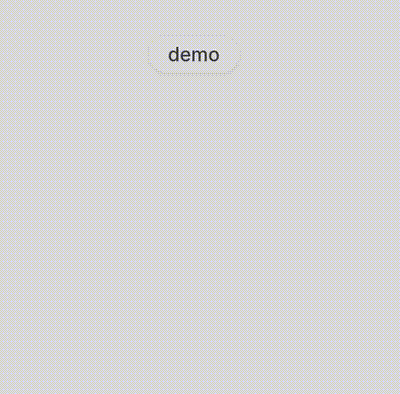

# Claudy

**Your desktop companion for Claude Code**

<p align="center">
  
</p>

Claudy (Clippy + Claude) is a small animated character that lives in your system tray and reacts to everything Claude does while you code together.

We've (almost) pixel-perfect (not) recreated CLAWD - Claude Code's mascot - to keep you company while you vibe.

---

## Installation

### From Release

Download the latest release for your platform from [Releases](https://github.com/mewset/claudy/releases).

**Linux (Debian/Ubuntu):**
```bash
sudo dpkg -i claudy_x.x.x_amd64.deb
```

> **Note:** We develop on Arch Linux and can't test all Linux distributions. If you encounter issues, please open an issue or build from source.

### From Source

**Prerequisites:**
- [Rust](https://rustup.rs/)
- [Node.js](https://nodejs.org/) (v18+)
- [Tauri prerequisites](https://tauri.app/v1/guides/getting-started/prerequisites)

**Build:**
```bash
git clone https://github.com/mewset/claudy.git
cd claudy
npm install
npm run tauri build
```

The built application will be in `src-tauri/target/release/bundle/`.

---

## Usage

### Show Claudy

After starting Claudy, click the tray icon and select **Show/Hide** to make Claudy visible on your desktop.

### Register a project

Use the CLI to register projects for Claudy to watch:

```bash
cd /path/to/your/project
claudy-cli register
```

**CLI commands:**
```bash
claudy-cli register     # Register current directory
claudy-cli unregister   # Unregister current directory
claudy-cli list         # List registered projects
claudy-cli config       # Show config file location
```

### Configuration

Claudy stores its config at `~/.config/claudy/config.toml`.

You can also access settings via the system tray icon → **Configuration**.

```toml
[appearance]
background = "#1a1a2e"  # or leave empty for transparent

[projects]
registered = [
    "/home/user/my-project",
    "/home/user/another-project"
]
```

---

## License

MIT
